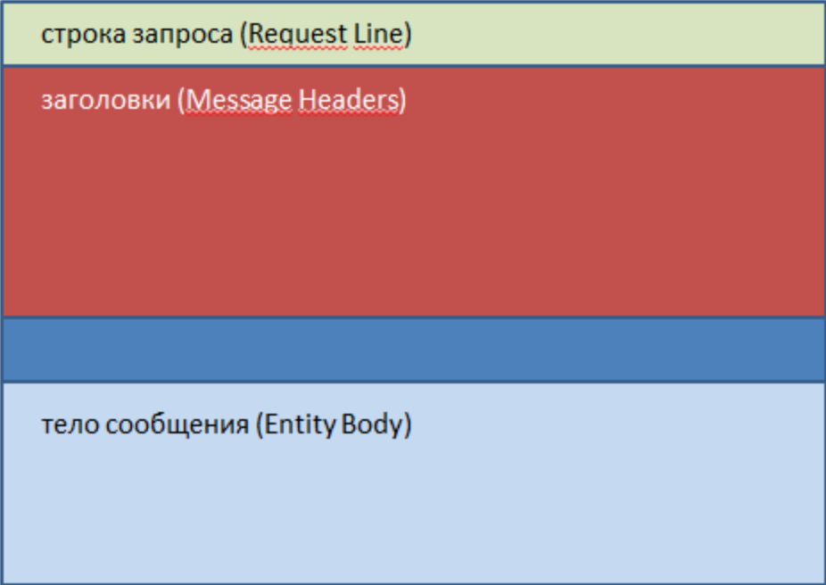

# Ответы к вопросам с se.ifmo.ru

## 1. Протокол HTTP. Структура запросов и ответов, методы запросов, коды ответов сервера, заголовки запросов и ответов.

HTTP запрос состоит из трех основных частей, которые идут в нем именно в том порядке, который указан ниже. 
Между заголовками и телом сообщения находится пустая строка (в качестве разделителя), она представляет собой символ 
перевода строки.



1. строка запроса (Request Line)

2. заголовки (Message Headers)

3. Пустая строка (разделитель)

4. тело сообщения (Entity Body) – необязательный параметр

**Строка запроса** – указывает метод передачи, URL-адрес, к которому нужно обратиться и версию протокола HTTP.

**Заголовки** – описывают тело сообщений, передают различные параметры и др. сведения и информацию.

**Тело сообщения**  — это сами данные, которые передаются в запросе.  Тело сообщения – это необязательный параметр и может отсутствовать.

Когда мы получаем ответный запрос от сервера, тело сообщения, чаще всего представляет собой содержимое веб-страницы. 
Но, при запросах к серверу, оно тоже может иногда присутствовать, например, когда мы передаем данные, которые заполнили 
в форме обратной связи на сервер.

*Запрос от браузера:*

```
GET / HTTP/1.1

Host: webgyry.info

User-Agent: Mozilla/5.0 (Windows NT 6.1; rv:18.0) Gecko/20100101 Firefox/18.0

Accept: text/html,application/xhtml+xml,application/xml;q=0.9,*/*;q=0.8

Accept-Language: ru-RU,ru;q=0.8,en-US;q=0.5,en;q=0.3

Accept-Encoding: gzip, deflate

Cookie: wp-settings

Connection: keep-alive
```

*Ответ сервера:*
```
HTTP/1.1 200 OK

Date: Sun, 10 Feb 2013 03:51:41 GMT

Content-Type: text/html; charset=UTF-8

Transfer-Encoding: chunked

Connection: keep-alive

Keep-Alive: timeout=5

Server: Apache

X-Pingback: //webgyry.info/xmlrpc.php

 

<!DOCTYPE html PUBLIC «-//W3C//DTD XHTML 1.0 Transitional//EN» «http://www.w3.org/TR/xhtml1/DTD/xhtml1-transitional.dtd»>
<html xmlns=»http://www.w3.org/1999/xhtml»>
<head>
<meta http-equiv=»Content-Type» content=»text/html; charset=utf-8″ />
<title>Документ без названия</title>
</head>
<body>
</body>
</html>
```

[Источник](https://webgyry.info/obshhaya-struktura-http-zaprosov-i-otvetov)

HTTP определяет множество **методов запроса** которые указывают, какое желаемое действие выполнится для данного ресурса. 
Несмотря на то, что их названия могут быть существительными, эти методы запроса иногда называются _HTTP глаголами_. Каждый реализует свою семантику, но каждая группа команд разделяет общие свойства: так, методы могут быть _безопасными_, _идемпотентными_ или _кэшируемыми_.

__Безопасные методы__ - не изменяют состояния сервера (read-only). Например `GET`, `HEAD` или `OPTIONS`.
__Идемпотентные методы__ - методы, которые при одинаковых запросах к серверу не меняют его состояние.
__Кэшируемые методы__ - могут быть сохранены для дальнейшего восстановления и использования, тем самым снижая число запросов к серверу.
    
Метод `GET` запрашивает представление ресурса. Запросы с использованием этого метода могут только извлекать данные.

`HEAD` запрашивает ресурс так же, как и метод `GET`, но без тела ответа.

`POST` используется для отправки сущностей к определенному ресурсу. Часто вызывает изменение состояния или какие-то побочные эффекты на сервере.

`PUT` заменяет все текущие представления ресурса данными запроса.

`DELETE` удаляет указанный ресурс.

`CONNECT` устанавливает соединение к серверу, определенному по ресурсу.

`OPTIONS` используется для описания параметров соединения с ресурсом.

`TRACE` выполняет вызов возвращаемого тестового сообщения с ресурса.

`PATCH` используется для частичного изменения ресурса

__Коды ответов__

__1xx:__ Информационные

__100:__ 

